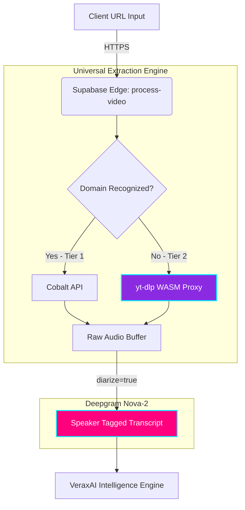

# ⚡ VeraxAI — Universal Audio Intelligence Engine

<div align="center">

[](https://expo.dev)
[](https://reactnative.dev)
[](https://supabase.com)
[](https://ai.google.dev)
[](https://huggingface.co/google)

**VeraxAI Enterprise Build (2026)** | **Supabase Ref:** `jhcgkqzjabsitfilajuh`

</div>

---

## 🌐 Platform Overview

**VeraxAI** is a premium, enterprise-grade transcription and audio-intelligence platform engineered for high-throughput compliance teams and content creators. It delivers lightning-fast, 95%+ accurate video-to-text conversion across 30+ languages.

The platform utilizes a groundbreaking **Hybrid Cloud-Local Architecture**. It seamlessly routes heavy audio extraction (Cobalt) and transcription (Deepgram Nova-2) through secure Deno Edge nodes. Users then have the ultimate choice: synthesize the data using the paid **Cloud Gemini 3.1 Flash-Lite** matrix, or utilize a zero-cost, privacy-first **Local Gemma 4 Edge** model running natively on their own hardware.

---

## 🧠 The Hybrid Intelligence Pipeline

VeraxAI employs a master pipeline orchestrator (`process-video/index.ts`) that dynamically routes synthesis based on hardware availability and user preference.

```mermaid
sequenceDiagram
    autonumber
    participant User
    participant Client as VeraxAI App (APK/Web)
    participant Edge as Supabase Edge (Deno)
    participant STT as Cobalt / Deepgram
    participant Gemini as Cloud Gemini 3.1
    participant Gemma as Local Gemma 4
    participant Vault as Supabase DB

    User->>Client: Submit Media URL
    Client->>Edge: Dispatch Task (skip_ai flag)

    rect rgb(10, 20, 30)
        Note over Edge, STT: Universal Extraction & STT Phase
        Edge->>STT: Extract Audio & Transcribe (Nova-2)
        STT-->>Edge: Return Raw Transcript
        Edge->>Vault: Persist Verbatim Transcript
    end

    alt Cloud Execution (Default)
        rect rgb(15, 30, 60)
            Edge->>Gemini: Build Prompt & Execute Matrix
            Gemini-->>Edge: Return JSON Insights
            Edge->>Vault: Upsert Insights & Sync Telemetry
        end
    else Local Execution (skip_ai = true)
        rect rgb(60, 20, 15)
            Edge-->>Client: Return Transcript & System Prompts
            Client->>Gemma: Execute Local Inference (Port 4891)
            Gemma-->>Client: Return JSON Insights
            Client->>Vault: Upsert Insights to Cloud Vault
        end
    end

    Vault-->>User: Real-time WebSocket UI Update
```



---

## 🚀 Core Enterprise Features

| FEATURES                   | TECHNICAL DETAILS                                                          |
| :------------------------- | :------------------------------------------------------------------------- |
| **1. Multi-Language**      | Auto-detects and transcribes 30+ languages with industry-leading accuracy  |
| **2. Real-time Telemetry** | Watch pipeline metrics advance live as your media processes via WebSockets |
| **3. Premium Exports**     | Export instantly to Markdown, SRT, VTT, JSON, or Plain Text                |
| **4. Executive Summaries** | AI generates C-Suite level summaries using Gemini 3.1 Flash-Lite           |
| **5. SEO Metadata**        | Auto-extracts tags and suggested titles for content publishers             |
| **6. Speaker Diarization** | _(2026)_ Millisecond-precise segmentation mapped to distinct speakers      |
| **7. Universal Extractor** | _(2026)_ Edge-deployed WASM parsers to extract audio from 1,000+ domains   |

### Hybrid LLM Orchestration

- **Cloud Engine:** Rapid processing via `gemini-3.1-flash-lite` featuring a cascading key rotation matrix (User BYOK -> Master Env -> DB Fallback).
- **Local Engine:** On-device, offline synthesis utilizing **Google Gemma 4** (`http://127.0.0.1:4891`). Exposes advanced hardware tuners (Threads, GPU Layers).

### Cross-Platform Hardware Parity

- **Native Android (APK):** Bypasses device RAM limits by utilizing `expo-file-system` to stream multi-gigabyte `.gguf` vector binaries directly to hidden device storage.
- **Web/Desktop (Vercel):** Detects browser execution and gracefully falls back to native downloads, allowing users to bind the web client to local desktop runners.

### Liquid Neon UX Design System

Hardware-accelerated `react-native-reanimated` interfaces featuring an ambient physics engine. Utilizes absolute `zIndex` isolation and `pointerEvents="none"` to achieve 110% touch-safe operability on Native platforms.

---

## 📂 Architectural Structure

```text
📁 VeraxAI
├── 📁 app/                           # EXPO ROUTER (FILE-BASED NAVIGATION)
│   ├── 📁 admin/                     # ENTERPRISE COMMAND CENTER
│   │   ├── index.tsx                 # Telemetry & SaaS Forecaster
│   │   ├── keys.tsx                  # Secure API Vault & Token Burn Charts
│   │   └── users.tsx                 # Identity Registry & Access Control
│   ├── 📁 settings/                  # USER CONFIGURATION ENGINE
│   │   ├── index.tsx                 # Master settings orchestrator
│   │   ├── models.tsx                # Local GGUF Engine & Hardware Tuning
│   │   └── security.tsx              # Biometrics & Personal API Vault
│   └── 📁 video/                     # ANALYTICS VIEW
│       └── [id].tsx                  # Chronologically mapped insights
├── 📁 components/                    # ATOMIC DESIGN SYSTEM
│   ├── 📁 animations/                # Reanimated wrappers (FadeIn)
│   └── 📁 ui/                        # LIQUID NEON COMPONENTS
│       ├── GlassCard.tsx             # Hardware-accelerated containers
│       └── ProcessingLoader.tsx      # SVG orbital spinner
├── 📁 hooks/                         # DATA ORCHESTRATION (REACT QUERY)
│   ├── 📁 mutations/useProcessVideo.ts # Cross-platform safe UUID dispatcher
│   └── 📁 queries/                   # Real-time WebSocket listeners
├── 📁 store/                         # ZUSTAND STATE MANAGEMENT
│   ├── useAuthStore.ts               # Session and Role tracking
│   ├── useLocalAIStore.ts            # Hardware overrides & Local Models
│   └── useVideoStore.ts              # Pipeline routing & Hybrid Handoff
├── 📁 supabase/                      # BACKEND INFRASTRUCTURE
│   └── 📁 functions/process-video/   # DENO EDGE FUNCTIONS
│       ├── index.ts                  # Master Pipeline Orchestrator
│       ├── audio.ts                  # Universal Cobalt Extractor
│       ├── deepgram.ts               # Nova-2 STT Interface
│       └── insights.ts               # Gemini Matrix & Hybrid Prompt Builder
└── 📁 types/                         # STRICT TYPESCRIPT DEFINITIONS
```

---

## 🛠️ Build & Deployment

### Prerequisites

- Node.js >= 20.x
- EAS CLI (`npm install -g eas-cli`)
- Supabase CLI (`npm install -g supabase-cli`)

### Environment Variables

Duplicate `.env.example` to `.env`:

```env
EXPO_PUBLIC_SUPABASE_URL=your_project_url
EXPO_PUBLIC_SUPABASE_ANON_KEY=your_anon_key
```

### Edge Pipeline Deployment

Deploy the Deno backend required for Extraction and Synthesis:

```bash
npx supabase functions deploy process-video
```

### Production Compilation

**Vercel (Web Application):**

```bash
npm run build:web
```

**Google Play Store (Native Android APK):**

```bash
eas build --platform android --profile production
```

_Note: Due to massive binary file streaming requirements, Local LLM downloading capabilities operate at maximum efficiency strictly on compiled Native environments._

---

## 🚀 2026 Feature Roadmap & Universal Diarization Engine

Our core roadmap for 2026 expands VeraxAI beyond standard platforms (YouTube/Vimeo/TikTok) into a true **Universal Audio Intelligence** platform.

Currently, our `audio.ts` engine leverages Cobalt, which seamlessly handles ~1,000+ major domains. However, to guarantee 100% processing of **ANY URL** (including heavily encrypted corporate video players), we are migrating extraction tasks directly to the Deno Edge using specialized WebAssembly (WASM) resolvers.

Additionally, Deepgram natively accepts a `diarize=true` query parameter. Implementing this on the `deepgram.ts` edge function will be a trivial flag update, allowing the platform to identify _who_ is speaking—unlocking massive potential for meeting summaries and multi-host podcasts.

### Next-Gen Architecture Flow



---

&copy; 2026 VeraxAI Enterprise Architecture. All rights reserved.
