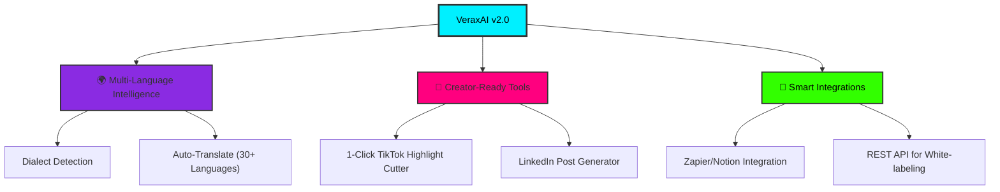

# ⚡ VeraxAI — Enterprise Audio Intelligence Engine

<div align="center">

[](https://expo.dev)
[](https://reactnative.dev)
[](https://supabase.com)
[](https://ai.google.dev)
[](https://veraxai.vercel.app/)

**Supabase Ref:** `jhcgkqzjabsitfilajuh`

</div>

---

## 🌐 Universal Audio Intelligence 🌐

**VeraxAI** is an transcription and audio-intelligence platform engineered for the modern digital landscape. Targeting a multi-billion dollar creator market, this application delivers lightning-fast, 95%+ accurate video-to-text conversion.

Designed for content creators and compliance teams, VeraxAI utilizes a multi-stage AI pipeline powered by **Google Gemini 3.1 Flash-Lite** and **Deepgram Nova-2** to generate SEO metadata, chapter markers, and actionable insights — all within a fluid, Reanimated-driven "Liquid Neon" dark glassmorphism interface.

---

## 🛡️ The 5 Technical Moats

| Strategic Pillar                | Technological Implementation        | Market Value Proposition                                                                  |
| :------------------------------ | :---------------------------------- | :---------------------------------------------------------------------------------------- |
| **Waterfall Cost Optimization** | Tiered Extraction (`process-video`) | Attempts $0 scraping via native captions first. Falls back to Deepgram only if necessary. |
| **Cascading API Rotation**      | UI-Managed Fallback Matrix          | AI autonomously rotates through database-injected API keys to bypass rate limits.         |
| **Neural Analytics**            | Real-time Telemetry Engine          | Live token burn tracking and SaaS MRR forecasting integrated into the Admin Root.         |
| **Hybrid Edge Architecture**    | Deno + Supabase Functions           | Zero-latency processing with strict schema enforcement for 100% valid JSON payloads.      |
| **"Liquid Neon" UX**            | React Native + Reanimated 4.2       | Hardware-accelerated GlassCards and Touch-Safe Ambient Orbs at 120fps.                    |

---

## 🗺️ The Pipeline Logic

This diagram illustrates the **Waterfall Cost Protocol**. If Layer 1 is successful, the system completely bypasses expensive API layers.

```mermaid
sequenceDiagram
    autonumber
    participant User as VertAI Client
    participant DB as Supabase (PostgreSQL)
    participant Edge as Deno Edge: process-video
    participant L1 as L1: Caption Scraper ($0)
    participant L2 as L2: Audio Proxy (Premium)
    participant STT as L3: Deepgram Nova-2
    participant AI as L4: Gemini 3.1 [TITAN]

    User->>DB: 1. INSERT video (status: queued)
    User->>Edge: 2. Invoke Orchestrator
    Edge->>DB: 3. UPDATE status: downloading

    rect rgb(10, 40, 10)
    Note over Edge, L1: TIER 1: Zero-Cost Native Scrape
    Edge->>L1: Attempt XML/JSON3 Scrape
    L1-->>Edge: Success? (Return Transcript)
    end

    alt Scraping Success
        Edge->>DB: 4a. INSERT transcripts (method: captions)
    else Scraping Failed
        rect rgb(40, 10, 10)
        Note over Edge, STT: TIER 2 & 3: Sovereign Fallback
        Edge->>L2: Resolve Audio Stream
        L2-->>Edge: Valid audio_url
        Edge->>STT: Transcribe Audio Stream
        STT-->>Edge: Return NOVA-2 Transcript
        Edge->>DB: 4b. INSERT transcripts (method: deepgram)
        end
    end

    Edge->>DB: 5. UPDATE status: ai_processing

    rect rgb(10, 20, 50)
    Note over Edge, AI: TIER 4: AI Synthesis Rotation
    Edge->>AI: generateInsights (Primary Key -> Fallback Matrix)
    AI-->>Edge: { summary, chapters, takeaways, seo }
    Edge->>DB: 6. UPSERT ai_insights (Track Token Burn)
    end

    Edge->>DB: 7. UPDATE status: completed
    DB-->>User: 8. Realtime WebSocket Update
```



```VeraxAI/
VeraxAI/
├── app/                              # EXPO ROUTER (FILE-BASED)
│   ├── admin/                        # ENTERPRISE COMMAND CENTER
│   │   ├── index.tsx                 # Telemetry & SaaS Forecaster
│   │   ├── keys.tsx                  # Secure API Vault & Token Burn Charts
│   │   └── users.tsx                 # Identity Registry & Access Control
│   ├── settings/                     # USER CONFIGURATION ENGINE
│   │   └── security.tsx              # Biometrics & Personal API Vault
│   └── video/                        # ANALYTICS VIEW
│       └── [id].tsx                  # Chronologically mapped insights
├── components/                       # ATOMIC DESIGN SYSTEM
│   ├── ui/                           # LIQUID NEON COMPONENTS
│   │   ├── GlassCard.tsx             # Hardware-accelerated containers
│   │   └── ProcessingLoader.tsx      # SVG orbital spinner
├── hooks/                            # DATA ORCHESTRATION (REACT QUERY)
│   └── mutations/useProcessVideo.ts  # Cross-platform safe UUID dispatcher
├── supabase/                         # BACKEND INFRASTRUCTURE
│   └── functions/process-video/
│       ├── insights.ts               # Gemini 3.1 Rotation & Telemetry logic
│       └── index.ts                  # Master Pipeline Orchestrator
└── assets/                           # BRANDED MEDIA ASSETS
```



---

| FEATURES                   | DETAILS                                                                   |
| :------------------------- | :------------------------------------------------------------------------ |
| **1. Multi-Language**      | Auto-detects and transcribes 30+ languages with industry-leading accuracy |
| **2. Real-time Feedback**  | Watch pipeline metrics advance live as your media processes               |
| **3. Premium Exports**     | Export instantly to Markdown, SRT, VTT, JSON, or Plain                    |
| **4. Executive Summaries** | AI generates C-Suite level summaries formatted with rich                  |
| **5. SEO Metadata**        | Auto-extracts tags and suggested titles for content publishers            |
| **6. Granular Timestamps** | Millisecond-precise segmentation mapped to the original audio             |
| **7. Cross-Platform**      | Engineered to extract audio from 10+ video hosting providers              |

---
