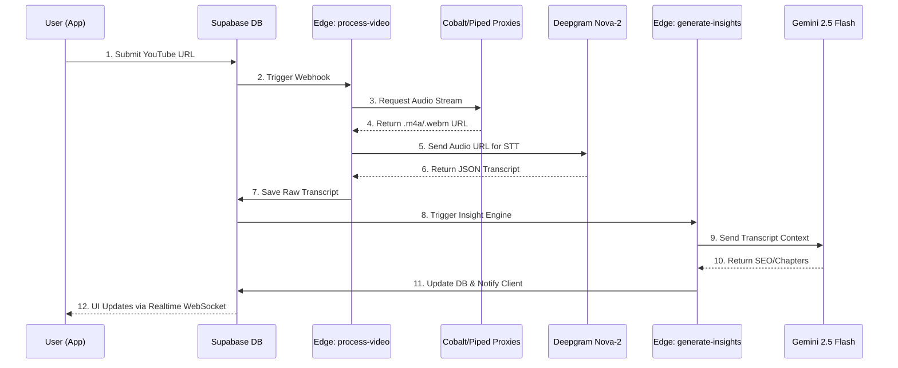

# ⚡ TranscriberPro: Enterprise Audio Intelligence Engine

<div align="center">

[](https://expo.dev)
[](https://reactnative.dev)
[](https://expo.dev)
[](https://docs.swmansion.com/react-native-reanimated/)
[](https://supabase.com)
[](https://deepgram.com)

</div>

---

## 🚀 Vision: The 2026 Standard for Audio Intelligence

**TranscriberPro** is an enterprise-grade YouTube transcription and audio-intelligence platform engineered for the modern digital landscape. Targeting a multi-billion dollar 2026 creator and accessibility market, this application delivers lightning-fast, 95%+ accurate video-to-text conversion.

Designed for content creators, educational institutions, researchers, and compliance teams, TranscriberPro goes beyond raw text—it utilizes multi-stage LLM processing to generate SEO metadata, chapter markers, and actionable insights.

---

## 🛡️ The 4 Technical Moats (Enterprise Differentiators)

| Strategic Pillar               | Technological Implementation                        | Market Value Proposition                                                                          |
| :----------------------------- | :-------------------------------------------------- | :------------------------------------------------------------------------------------------------ |
| **1. Anti-Block Architecture** | Multi-proxy extraction (Cobalt/Piped) via Deno Edge | **Unstoppable Reliability:** Bypasses YouTube datacenter IP blocking, guaranteeing stream access. |
| **2. Lightning Transcription** | Deepgram Nova-2 API + Smart Formatting              | **Sub-30s Processing:** Transcribes a 10-minute video in under 30 seconds with 95%+ accuracy.     |
| **3. AI Insight Engine**       | Gemini 2.5 Flash via Serverless Functions           | **Zero-Touch SEO:** Auto-generates chapters, summaries, and high-conversion metadata.             |
| **4. "Liquid Neon" UX**        | Reanimated v4 + NativeWind v4 + Expo Blur           | **Elite 120fps Experience:** A premium dark-mode Bento Box UI with cyan glassmorphism cards.      |

---

## 🗺️ User Experience & Data Flow



---

## 🛠️ Technology Stack Optimized for 2026

### **Frontend (The Glassmorphism Shell)**

- **Framework:** Expo SDK 55 + React Native 0.83.2 (New Architecture enabled).
- **Routing:** Expo Router v3 for file-based, type-safe navigation and deep linking.
- **Styling:** NativeWind v4 (Tailwind CSS engine) configured for strict dark mode (`#0A0D14`) and neon cyan accents.
- **State & Data:** Zustand for synchronous UI state + TanStack React Query v5 for asynchronous server caching.
- **Animations:** React Native Reanimated v4 worklets driving 120fps transitions.

### **Backend & Infrastructure (The Engine Room)**

- **Database & Auth:** Supabase Enterprise (PostgreSQL) with strict Row Level Security (RLS).
- **Compute:** Supabase Deno Edge Functions for serverless processing (Zero cold-start latency).
- **Speech-to-Text:** Deepgram Nova-2 for ultra-fast, diarized transcription.
- **LLM Pipeline:** Google Gemini 2.5 Flash for contextual analysis and formatting.

---

## 📁 Project Architecture

Strict adherence to Domain-Driven Design (DDD) tailored for Expo Router:

```text
/transcriber-pro
├── app/                  # Expo Router App Directory
│   ├── (auth)/           # Authentication flows
│   ├── (dashboard)/      # Protected Application Routes
│   │   ├── settings/     # Security, Profile, Billing
│   │   └── video/        # Dynamic Video & Transcript Viewers
│   ├── _layout.tsx       # Root layout & Provider injection
│   └── index.tsx         # Landing / Splash screen
├── components/           # Reusable UI Architecture
│   ├── animations/       # Reanimated v4 Wrappers
│   ├── domain/           # Business-specific components
│   ├── layout/           # Responsive structural components
│   └── ui/               # Core design system (GlassCards, Neon Inputs)
├── hooks/                # React Query & Supabase Hooks
│   ├── mutations/        # Data modification logic
│   └── queries/          # Data fetching & Realtime subscriptions
├── lib/                  # Core Infrastructure Interfaces
│   ├── api/              # Edge function callers
│   └── supabase/         # Supabase client & Secure Storage
├── services/             # Pure business logic
│   ├── exportBuilder.ts  # Generates SRT, VTT, DOCX, JSON
│   └── youtube.ts        # URL validation & metadata extraction
├── store/                # Zustand global state slices
├── supabase/             # Infrastructure as Code
│   ├── functions/        # Deno Edge Functions
│   └── snippets/         # SQL Schemas, RLS Policies, DB Seeds
└── types/                # Strict TypeScript Definitions
```

---

## ⚡ Core Features Implementation

### 1. Batch Processing & Queue Management

Videos are submitted to the Supabase PostgreSQL database, triggering our Deno `process-video` Edge Function. The client subscribes to progress updates via Supabase Realtime Channels, utilizing `TanStack Query` to optimistically update the UI.

### 2. Multi-Format Export Engine

The `services/exportBuilder.ts` handles client-side parsing of the deepgram JSON output into standard formats:

- **SRT/VTT:** Time-synced subtitle tracks for Premiere Pro/DaVinci Resolve.
- **DOCX/TXT:** Clean, readable formats for blog conversion.
- **JSON:** Raw developer-friendly output for API integrations.

### 3. Real-Time Video Status Tracking

By leveraging `useRealtimeVideoStatus.ts`, the UI updates fluidly through 5 discrete states without manual polling:
`Idle` ➔ `Downloading` ➔ `Transcribing` ➔ `AI Processing` ➔ `Completed`

---

## 💻 Getting Started (Local Development)

### Prerequisites

- Node.js v20+
- Supabase CLI installed (`brew install supabase/tap/supabase`)
- Expo CLI (`npm install -g expo-cli`)

### Environment Setup

1. **Install Dependencies**

   ```bash
   npm install
   ```

2. **Configure Environment Variables**
   Create a `.env` file in the root directory:

   ```env
   EXPO_PUBLIC_SUPABASE_URL=your_supabase_url
   EXPO_PUBLIC_SUPABASE_ANON_KEY=your_anon_key
   ```

   _Note: Edge function secrets (Deepgram, Gemini) must be set via the Supabase CLI._

3. **Start the Supabase Local Stack**

   ```bash
   npm run supabase:start
   ```

4. **Serve Edge Functions Locally**

   ```bash
   npm run functions:serve
   ```

5. **Launch the Expo Application**

   ```bash
   npm run start
   ```

---

## 🔒 Security & Performance Guidelines

1. **Type Safety:** The project enforces `strict: true` in `tsconfig.json`. Use the auto-generated `database.types.ts` from Supabase for all database interactions. No `any` types permitted.
2. **Authentication:** JWT tokens are secured using `expo-secure-store`. Tokens are never exposed to standard `AsyncStorage`.
3. **Rendering:** All heavy lists must use `@shopify/flash-list`. Standard `FlatList` is banned to maintain the 120fps target.
4. **Edge Processing:** All computationally expensive tasks (URL resolution, LLM prompts) are strictly sandboxed in Deno Edge Functions to prevent UI thread blocking and API key exposure.
